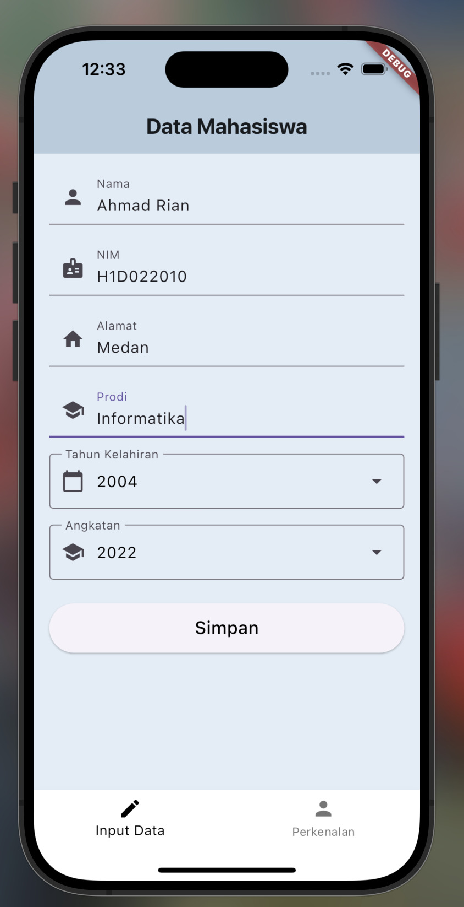
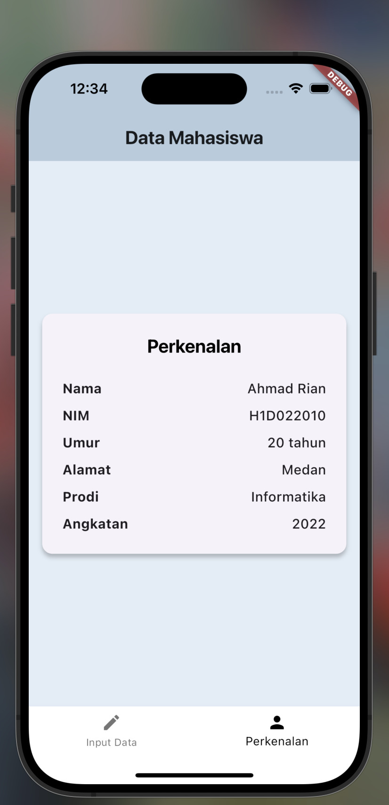

# Tugas Pertemuan 2

Nama: **Ahmad Rian Syaifullah Ritonga**  
NIM: **H1D022010**  
Shift Baru: **D**

Pada tugas pertemuan kali ini, akan dijelaskan proses passing data dari form menuju tampilan Perkenalan dalam aplikasi Flutter. Berikut adalah langkah-langkahnya:

## 1. Pengisian Form (FormData Widget)

- Pengguna membuka aplikasi dan melihat form input pada halaman pertama.
- Pengguna mengisi data di form, termasuk:
  - Nama
  - NIM
  - Tahun Kelahiran
  - Alamat
  - Prodi
  - Angkatan

## 2. Validasi dan Pengiriman Data

- Ketika pengguna menekan tombol **"Simpan"**:
  - Form melakukan validasi untuk memastikan semua field terisi dengan benar.
  - Jika valid, method `_submitForm()` dipanggil.
  - `_submitForm()` memanggil callback `onSimpan` yang diberikan oleh **MainScreen**, mengirimkan semua data form.

## 3. Penerimaan Data di MainScreen

- **MainScreen** menerima data melalui method `_onSimpan`.
- Di dalam `_onSimpan`, state **MainScreen** diperbarui dengan data baru menggunakan `setState()`.
- Setelah memperbarui state, **MainScreen** mengubah indeks tampilan ke **TampilData**.

## 4. Pembaruan Tampilan

- Karena state telah berubah, Flutter memicu rebuild pada widget tree.
- `IndexedStack` di **MainScreen** sekarang menampilkan **TampilData** widget.

## 5. Menampilkan Data (TampilData Widget)

- **TampilData** widget menerima data baru sebagai props dari **MainScreen**.
- **TampilData** membangun tampilan berdasarkan data yang diterima.
- Informasi yang ditampilkan meliputi:
  - Nama
  - NIM
  - Umur (dihitung dari tahun kelahiran)
  - Alamat
  - Prodi
  - Angkatan

## 6. Interaksi Pengguna

- Pengguna dapat melihat data yang telah diinput pada layar **"Perkenalan"**.
- Pengguna dapat beralih kembali ke form input menggunakan bottom navigation bar jika ingin mengubah data.

## 7. Alur Kembali

- Jika pengguna kembali ke form input, data sebelumnya masih tersimpan di state **MainScreen**.
- Pengguna dapat mengubah data dan menyimpannya kembali, yang akan memperbarui tampilan **TampilData**.

---

Alur ini mendemonstrasikan bagaimana data mengalir dari input pengguna melalui berbagai komponen aplikasi (**FormData** -> **MainScreen** -> **TampilData**) menggunakan state management dan props passing dalam Flutter.

## Screenshot

Contoh tampilan form dan hasil data yang telah disimpan:

